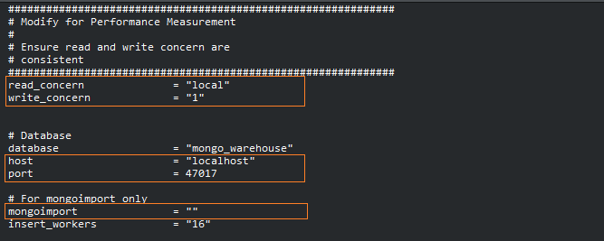
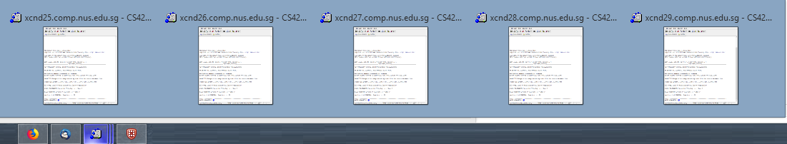

## Prerequisites

The code uses Python (Python 2.7.5), as well as PyMongo.

We will assume that you are using a Linux-based system, or at least have access to a Linux-based terminal

In summary, ensure the following:

* virtualenv
* File path for mongoimport
* Mongodb instances running on all the relevant nodes
* [Dataset](http://www.comp.nus.edu.sg/%7Ecs4224/4224-project-files.zip)

Refer to the section [Setting up virtualenv](#set_virtualenv), and [Obtaining File Path of mongoimport](#get_mongoimport) for help.

<hr/>

### <a name="set_virtualenv"></a> Setting up virtualenv

The following code will circumvent the restriction where users are not able to use `pip` to install the package in `/usr/lib/python2.7/site-packages`

1. Download the `virtualenv` source code, and run the script locally. At the end, you should get the full path of the file, `virtualenv.py`

```
$ curl -O https://pypi.python.org/packages/source/v/virtualenv/virtualenv-1.9.tar.gz
$ tar xvfz virtualenv-1.9.tar.gz
$ cd virtualenv-1.9
$ realpath virtualenv.py
$ # The full path of virtualenv.py will be obtained, take note of the path
$ # A possible output: /home/stuproj/cs4224f/virtualenv-1.9/virtualenv.py (results will vary)
```

2. Ensure that the `virtualenv.py` is executable

```
$ chmod +x virtualenv.py
```

<hr/>

### <a name="get_mongoimport"></a> Obtaining File Path of Mongoimport

1. Run the following script to get all the possible path of cqlsh
```
$ whereis mongoimport
$ # Possible output
$ # mongoimport: /usr/bin/mongoimport /temp/cs4224f/mongodb/bin/mongoimport
```

2. Ensure that the full path of the executable permits you to run query on it. Make sure the `mongoimport` is the one you intend to use.

<hr/>

## Setup

0. Download and unzip the project repository - we assume that the project repository zip file downloaded is `cs4224f-mongodb-master.zip`, however, this might change in the future.

```
$ # Assume that the project directory is placed in the home directory
$ cd ~
$ # Assume the project folder is called cs4224f-mongodb-master.zip
$ # However, this assumption may not hold in future release - hence make changes accordingly
$ unzip cs4224f-mongodb-master.zip
$ rm cs4224f-mongodb-master.zip
```

1. Create an environment directory, `env`. We assume that you have set up virtualenv using the above - hence replace the variable \<virtualenv\> with the full path of the file, `virtualenv.py`. Otherwise, you may simply replace \<virtualenv\> with `virtualenv`.

```
$ # Ensure that you are at the root of the project repository
$ cd ~/cs4224f-mongodb-master
$ <virtualenv> env
$ # The following is an example
$ # /home/stuproj/cs4224f/virtualenv-1.9/virtualenv.py env
```

2. Install all dependencies in requirement.txt

```
$ source ./env/bin/activate
(env) $ # You should see (env) prepended to the command prompt
(env) $ pip install -r requirement.txt
```

2a. __Note__ that occassionally, `pip install -r requirements.txt` may not work. Our experience is that installing `numpy`, followed by `pandas` separately should resolve the problem.

```
(env) $ pip install numpy==1.13.3
(env) $ pip install pandas==0.21.0rc1
(env) $ pip install -r requirement.txt
```

3. Download the dataset if you have not, and move them to `/data` folder. Thereafter, move all transaction files to the `/xact/` folder.

```
(env) $ wget http://www.comp.nus.edu.sg/~cs4224/4224-project-files.zip
(env) $ unzip 4224-project-files.zip
(env) $ mv ./4224-project-files/data-files/*.csv ./data
(env) $ mv ./4224-project-files/xact-files/*.txt ./xact-files
```

4. Set up the configuration file. `config.conf`.



4a. Boxed in orange are the variables to configure.

* __read_concern__: Takes on a value of either "local", or "majority" (Ensure consistency with __write_concern__)
* __write_concern__: Takes on a value of either "1", or "majority" (Ensure consistency with __read_concern__)
* __host__: Self-explanatory
* __port__: Self-explanatory
* __mongoimport__: Set the path of the mongoimport, as outlined in [Obtaining File Path of mongoimport](#get_mongoimport)

5. Run `python import.py` to import the data into mongodb. If you fail to set `mongoimport` in `config.conf`, you will be prompted to do so.

<hr/>

### Running MongoDB Benchmarking

We will make the assumption that you have configured all the nodes properly, and that they have access to MongoDB.

1. Ensure that all the nodes are logged in (i.e. that you have access to all the nodes), and that they are currently in the root of the project directory. Assign each node a number, starting from 0, in increasing order.



2. For each node, execute the `screen` command, and ensure that `virtualenv` is activated. The `screen` command allows you to run the benchmarking even if you close your terminal.

```
$ screen
$
$ # Move to the root of directory
# cd ~/cs4224f-mongodb-master
$
$ # Activate virtualenv if you have not done so
$ source ./env/bin/activate
```

3. On each node, run `source ./total_act_test.sh {0.. Number of node - 1} {$NC}`. For instance,

```
(env) $ total_act_test.sh 4 40
```

3a. (Optional) You may enter `Ctrl A + D` to detach the screen. Use `screen -r` to reattach to the `screen`.

4. At the end of the experiment, collect the output file, `{0.. Number of node - 1}-state.txt` from the `xres` directory.
